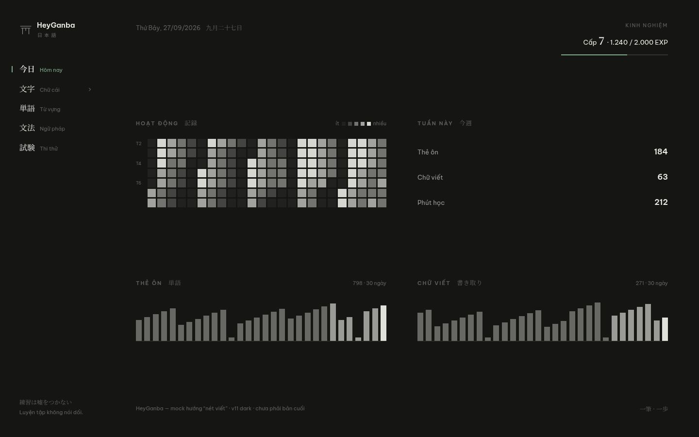
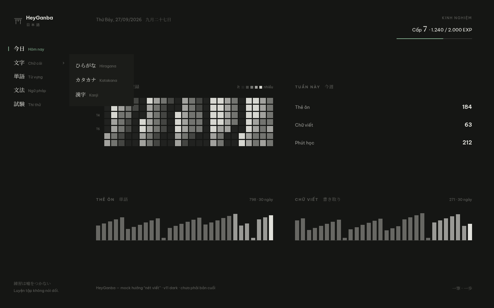
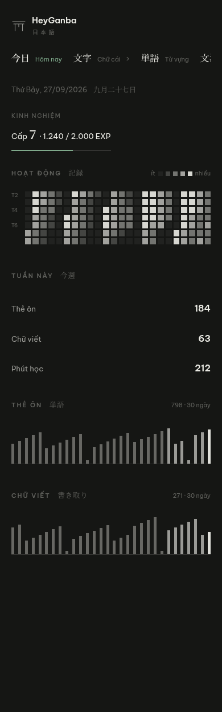
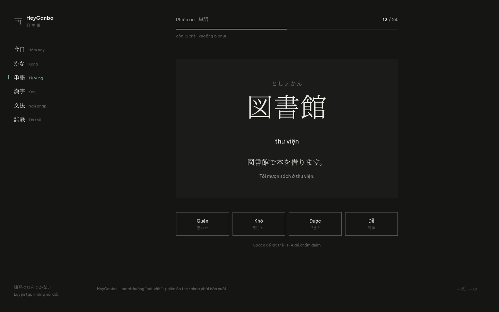

# Design — HeyGanba

Hệ thị giác "mực trên giấy", đảo tối. Chữ Nhật là nhân vật chính, chữ Việt là sàn đọc.
Mock tham chiếu: [`docs/Design/mock-dashboard.html`](docs/Design/mock-dashboard.html) · [`docs/Design/mock-flashcard.html`](docs/Design/mock-flashcard.html)

---

## 1. Nền tảng

### Màu

| Token | Giá trị | Dùng cho |
|---|---|---|
| `--bg` | `#151614` | nền mực toàn app |
| `--fg` | `#ECECE6` | chữ giấy |
| `--fg-60` / `--fg-38` | `rgba(236,236,230,.60)` / `rgba(236,236,230,.34)` | chữ phụ / chữ mờ |
| `--rule` / `--rule-strong` | `rgba(236,236,230,.14)` / `rgba(236,236,230,.30)` | đường dữ liệu / đường biên |
| `--card` | `#1B1C19` | bề mặt phụ (flyout, thẻ học) |
| `--rank` | `#7FA98B` | cấp độ, thanh EXP, trạng thái "đang đứng" |
| `--red` | `#D96A5C` | chữa bài (tensaku) |

Luật: **đúng hai màu có việc** — xanh đai và đỏ chữa bài. Mọi thứ còn lại là mực, phân biệt bằng *độ đậm* (opacity của `--fg`). Tracker mật độ đọc bằng mực, không bằng màu.

Cấm: gradient, glow, bóng đổ, kính mờ, xám riêng ngoài thang mực.

### Chữ

- **JP — `Noto Serif JP`** (300/400/600): tiêu đề, nav, nội dung học
- **VI — `Be Vietnam Pro`** (400/500/600): nhãn, ghi chú, nút

Thang chữ dùng thật:

| Cỡ | Vai |
|---|---|
| 76px serif 300 | chữ học lớn (kana, từ) |
| 30px sans 600 | tiêu đề màn |
| 22–24px serif 600 | con số trạng thái (cấp, EXP) |
| 21px serif 300 | câu ví dụ tiếng Nhật |
| 16–18px | nav JP, nghĩa từ |
| 13.5–14.5px | body |
| 12.5px | chữ phụ |
| 10.5–11px caps, tracking .14–.18em | nhãn nhỏ |

Không dùng font mảnh ở cỡ nhỏ — body tối thiểu 12.5px; nét mảnh chỉ thuộc về thứ lớn (kana, con số, đường kẻ).

### Hình khối & khoảng cách

- Bo góc **0** ở mọi nơi; không bóng; không viền panel
- Nhịp dọc: sàn `28px` giữa các khối, `56px` giữa các hàng, `64px` giữa hai cột
- Trong khối: nhãn cách nội dung `22px`
- Sidebar rộng `216px`; nav cách nhau `14px`
- Chuyển động: chỉ opacity, `~120ms ease`; không bounce, không trượt dài

## 2. Luật bố cục

1. **Một điểm neo mỗi màn.** Màn "làm" (phiên học): điểm neo là nội dung. Màn "trạng thái" (dashboard): điểm neo là khối dữ liệu lớn nhất. Không hai thứ cùng tranh sáng.
2. **Đường kẻ chỉ khi mang thông tin** — lưới ô viết, baseline đồ thị, vạch tiến độ. Không kẻ phân cách, không khung bao: phân chia bằng khoảng trống và cỡ chữ.
3. **Lưới phẳng, cột đều nhau.** Mọi khối fluid, lấp đủ bề ngang màn hình — không `max-width`.
4. **Nhịp dọc giãn đều** giữa header / các hàng / footer (`space-between` + sàn gap).
5. **Mobile ngang hàng laptop.** Mọi tương tác hover có đường tap tương đương; nav nhóm mở bằng tap, flyout chuyển thành inline trên mobile.

## 3. Thành phần

**Sidebar** — 5 mục: `今日 · 文字 · 単語 · 文法 · 試験`. Nhóm `文字 · Chữ cái` mở dropdown `ひらがな / カタカナ / 漢字` bằng hover (desktop), tap (mobile), focus (bàn phím). Flyout: nền `--card`, rộng tối thiểu `188px`, mục cách `9px 18px`, hover tint `rgba(236,236,230,.05)`. Mục đang xem: vạch xanh `2px` bên trái mục cha + chữ JP đậm + nhãn VI màu `--rank`.

**Tracker** — heatmap mật độ mực 24 tuần × 7 ngày. Ô vuông (`aspect-ratio:1`), gap `3px`, tự giãn kín cột. Mật độ = opacity mực: `0.06 / 0.22 / 0.44 / 0.66 / 0.9`. Nhãn thứ `9px` ở hàng T2/T4/T6; legend ô `8px` "ít → nhiều".

**Đồ thị hoạt động** — cột mực mảnh 30 ngày (thẻ ôn · chữ viết). Cột rộng `min(12px, 3%)`, giãn đều hết bề ngang; cao `88px` (mobile `72px`). Độ đậm: nền `.38` — 7 ngày gần nhất `.62` — hôm nay `.95`. Baseline `1px --rule`.

**Cấp độ** — số serif `22px` + thanh EXP cao `2px`, track `--rule`, fill `--rank`. EXP chỉ cộng từ hoạt động học thật (thẻ ôn, chữ viết, câu trả lời đúng).

**Thẻ học & phiên ôn** — thẻ nền `--card`, padding `60px 56px 52px`; từ `76px` serif, furigana `15px --fg-38`, nghĩa `18px`, ví dụ `21px`, dịch `13px --fg-60`. Chấm điểm: 4 nút `Quên / Khó / Được / Dễ` ngang hàng, viền `1px --rule-strong`, hover đảo mực/giấy. Phím tắt hiện dưới dạng gợi ý nhỏ: `Space để lật thẻ · 1–4 để chấm điểm`.

**Nút & focus** — viền `1px`, radius 0; hover đảo mực/giấy. Focus bàn phím: viền mảnh `1px --fg-38`, offset `3px`.

## 4. Ảnh tham chiếu

*Mock phiên ôn là bản tham chiếu cũ (chưa có nav nhóm) — cập nhật khi build màn đó.*

## 5. Còn để ngỏ

- Công thức EXP (cộng bao nhiêu mỗi hoạt động)
- Màu cấp độ: một màu xanh cho mọi cấp, hay mỗi cấp một màu
- Nhãn nhóm nav: "Chữ cái" (hiện tại) vs "Ký tự" / "Chữ viết"
- Khối gợi nhớ / nhiệm vụ kế tiếp: đã gỡ khỏi dashboard; để dành cho phiên học/từng trạm

## 6. Làm việc với hệ này

- Đọc `PRODUCT.md` (sự thật sản phẩm) trước khi sửa UI
- Trước khi đổi bố cục: so với mock trong `docs/Design/`
- Sau khi sửa UI: chạy detector `.opencode/skills/impeccable/scripts/impeccable detect <đường dẫn>`
