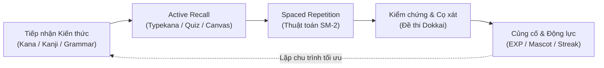
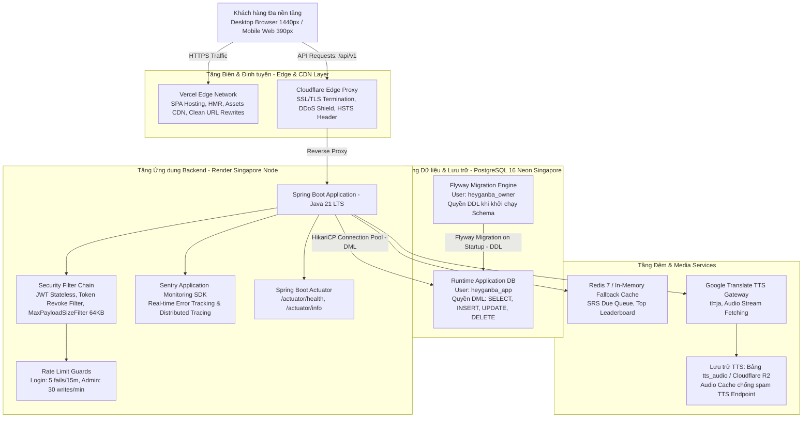

# HeyGanba! (ヘイガンバ) — Enterprise Japanese Learning Platform

<div align="center">

[](https://spring.io/projects/spring-boot)
[](https://openjdk.org/projects/jdk/21/)
[](https://react.dev/)
[](https://www.typescriptlang.org/)
[](https://www.postgresql.org/)
[](https://redis.io/)
[](https://tailwindcss.com/)
[](https://sentry.io/)
[](https://github.com/thach09/heyganba/actions/workflows/ci.yml)
[](./README.md)

**Nền tảng đào tạo & tự học tiếng Nhật chuẩn khung năng lực JLPT N5–N4 và giáo trình Dekiru Nihongo.**  
*Tích hợp Spaced Repetition System (SRS SM-2), Canvas viết tay chữ Nhật, Sinh đề thi Dokkai thông minh, Gamification và Cổng quản trị phân quyền đa cấp.*

[🌐 Trải nghiệm Production](https://heyganba.site) · [📋 Thiết kế Giao diện (DESIGN.md)](./frontend/DESIGN.md) · [📐 Kiến trúc Kỹ thuật (ARCHITECTURE.md)](./frontend/ARCHITECTURE.md) · [🛡️ Kế hoạch Bảo mật](./docs/Internal/security-plan.md) · [🚀 Kế hoạch Triển khai](./docs/Internal/deployment-plan.md)

</div>

---

## 📑 Mục lục (Table of Contents)

1. [Tầm nhìn Sản phẩm & Phân tích Nghiệp vụ (BA Vision)](#-1-tầm-nhìn-sản-phẩm--phân-tích-nghiệp-vụ-ba-vision)
   - 1.1 [Bối cảnh Thực tế & Bài toán Doanh nghiệp](#11-bối-cảnh-thực-tế--bài-toán-doanh-nghiệp)
   - 1.2 [Mô hình Giải pháp Khoa học & Cơ chế Học tập](#12-mô-hình-giải-pháp-khoa-học--cơ-chế-học-tập)
   - 1.3 [Chân dung Người dùng & Điểm chạm Trải nghiệm (Personas)](#13-chân-dung-người-dùng--điểm-chạm-trải-nghiệm-personas)
   - 1.4 [Hệ thống Chỉ số Hiệu quả Nghiệp vụ (KPIs)](#14-hệ-thống-chỉ-số-hiệu-quả-nghiệp-vụ-kpis)
   - 1.5 [Từ điển Thuật ngữ Nghiệp vụ (Domain Glossary)](#15-từ-điển-thuật-ngữ-nghiệp-vụ-domain-glossary)
2. [Hệ sinh thái Tính năng & 5 Trạm Học tập](#-2-hệ-sinh-thái-tính-năng--5-trạm-học-tập)
3. [Kiến trúc Hệ thống & Quyết định Kỹ thuật (Senior Dev Perspective)](#-3-kiến-trúc-hệ-thống--quyết-định-kỹ-thuật-senior-dev-perspective)
   - 3.1 [Sơ đồ Kiến trúc Phân tầng (Architecture Diagram)](#31-sơ-đồ-kiến-trúc-phân-tầng-architecture-diagram)
   - 3.2 [Bảng Lựa chọn Công nghệ & Lý do Kiến trúc (ADR Summary)](#32-bảng-lựa-chọn-công-nghệ--lý-do-kiến-trúc-adr-summary)
   - 3.3 [Tiêu chuẩn Thiết kế REST API & Danh mục Endpoints](#33-tiêu-chuẩn-thiết-kế-rest-api--danh-mục-endpoints)
   - 3.4 [Danh mục Biến Môi trường (Environment Variables Reference)](#34-danh-mục-biến-môi-trường-environment-variables-reference)
4. [An toàn Thông tin & Quản trị Rủi ro (Security & Compliance)](#-4-an-toàn-thông-tin--quản-trị-rủi-ro-security--compliance)
   - 4.1 [Chính sách Zero-Plaintext Credential](#41-chính-sách-zero-plaintext-credential)
   - 4.2 [Tách biệt Quyền hạn Cơ sở Dữ liệu (DB Role Isolation)](#42-tách-biệt-quyền-hạn-cơ-sở-dữ-liệu-db-role-isolation)
   - 4.3 [Xác thực Đa lớp, Thu hồi Token & Kiểm soát Tần suất](#43-xác-thực-đa-lớp-thu-hồi-token--kiểm-soát-tần-suất)
5. [Chiến lược Dữ liệu & Flyway Migration Governance](#-5-chiến-lược-dữ-liệu--flyway-migration-governance)
6. [Hạ tầng & Topo Triển khai Đa môi trường (DevOps Topology)](#-6-hạ-tầng--topo-triển-khai-đa-môi-trường-devops-topology)
7. [Hướng dẫn Khởi chạy Nhanh (Local Developer Onboarding)](#-7-hướng-dẫn-khởi-chạy-nhanh-local-developer-onboarding)
   - 7.1 [Khởi chạy Trọn gói qua Docker Compose (Khuyên dùng)](#71-khởi-chạy-trọn-gói-qua-docker-compose-khuyên-dùng)
   - 7.2 [Khởi chạy Thủ công Từng Phân hệ](#72-khởi-chạy-thủ-công-từng-phân-hệ)
8. [Đảm bảo Chất lượng & Ma trận Kiểm thử (QA Lead Perspective)](#-8-đảm-bảo-chất-lượng--ma-trận-kiểm-thử-qa-lead-perspective)
   - 8.1 [Kim tự tháp Kiểm thử Tự động (Test Automation Pyramid)](#81-kim-tự-tháp-kiểm-thử-tự-động-test-automation-pyramid)
   - 8.2 [Tiêu chuẩn Kiểm thử Giao diện (Responsive QA Gate)](#82-tiêu-chuẩn-kiểm-thử-giao-diện-responsive-qa-gate)
   - 8.3 [Release Pre-flight Checklist (QA Sign-off)](#83-release-pre-flight-checklist-qa-sign-off)
9. [Quy chuẩn Đóng góp & Quy trình Kỹ thuật (Contributing)](#-9-quy-chuẩn-đóng-góp--quy-trình-kỹ-thuật-contributing)

---

## 🎯 1. Tầm nhìn Sản phẩm & Phân tích Nghiệp vụ (BA Vision)

### 1.1. Bối cảnh Thực tế & Bài toán Doanh nghiệp
Việc học tiếng Nhật giai đoạn sơ cấp (tương đương chuẩn JLPT N5–N4 và giáo trình đại học Dekiru Nihongo JPD113/JPD123) đối mặt với các rào cản lớn:
- **Tải lượng nhận thức quá mức:** Khối lượng 3 hệ chữ viết (Hiragana, Katakana, Hán tự Kanji) cùng hàng trăm biến thể âm thanh dễ gây nản lòng trong 2 tuần đầu.
- **Hiện tượng "Ảo tưởng ghi nhớ" (Illusion of Competence):** Đọc thụ động tạo cảm giác đã hiểu, nhưng rơi rụng hơn 80% sau 48 giờ theo đường cong quên lãng Ebbinghaus.
- **Phân mảnh tài liệu:** Học viên phải chia nhỏ công cụ: một app học chữ, một app tra từ điển, làm đề trên giấy và thiếu cơ chế phản hồi giải thích các lỗi sai kinh điển (Common Mistakes).
- **Rủi ro chất lượng nội dung:** Các nền tảng cộng đồng thường chứa sai sót trợ từ, phát âm lệch chuẩn và thiếu sự phân cấp kiểm duyệt.

### 1.2. Mô hình Giải pháp Khoa học & Cơ chế Học tập
**HeyGanba!** được xây dựng như một hệ sinh thái học tập khép kín, ứng dụng khoa học nhận thức và phương pháp sư phạm hiện đại:



1. **Khoa học Ngắt quãng (Spaced Repetition System - SM-2):**  
   Thuật toán SM-2 cá nhân hoá lịch ôn tập dựa trên hệ số dễ (`easiness_factor`), số lần ôn liên tiếp (`repetitions`) và khoảng cách ngày (`interval_days`). Chỉ những thẻ đến hạn (`due_date <= now()`) mới được nạp vào phiên ôn tập.
2. **Kích hoạt Đa giác quan (Multi-sensory Active Recall):**  
   - *Thính giác:* Audio TTS bản ngữ chuẩn Tokyo kết hợp cơ chế Server-side Caching.
   - *Vận động & Cơ tay:* Canvas viết tay nhận diện nét vẽ và chế độ gõ phản xạ bàn phím Typekana.
   - *Tư duy Phản xạ:* Trắc nghiệm 4 đáp án hoán vị ngẫu nhiên (chống học vẹt vị trí).
3. **Vòng lặp Tạo Thói quen (Habit Formation & Gamification):**  
   - Hệ thống **EXP Leveling** thưởng điểm theo độ khó tác vụ.
   - **Linh vật đồng hành tiến hoá:** `Trứng (🥚) → Nở (🐣) → Chíp (🐤) → Gà con (🐥) → Đại bàng (🦅) → Rồng (🐉)` tương ứng với sự bền bỉ.
   - **Streak & Heatmap:** Tính theo chuẩn múi giờ thực tế của học viên (`Asia/Ho_Chi_Minh`), đòi hỏi nỗ lực thực tế (tối thiểu 10 lượt SRS hoặc 1 đề thi hoặc 10 câu ngữ pháp).
4. **Cổng Kiểm duyệt Chất lượng (Curriculum Quality Gate):**  
   Toàn bộ nội dung học thuật tuân thủ quy tắc State Machine: Dữ liệu mới biên soạn luôn ở trạng thái `PENDING_REVIEW` và chỉ hiển thị công khai khi được chuyên môn thẩm định `APPROVED`.

### 1.3. Chân dung Người dùng & Điểm chạm Trải nghiệm (Personas)

| Tiêu chí | 🎓 Học viên Sơ cấp (Student) | 👨‍🏫 Giảng viên / Chuyên viên (Educator) | 🛡️ Quản trị viên Kỹ thuật (Admin) |
|:---|:---|:---|:---|
| **Mục tiêu chính** | Vượt qua kỳ thi JLPT N5/N4, nhớ mặt chữ, không nhầm trợ từ. | Quản lý ngân hàng đề thi, biên soạn câu hỏi bẫy, giám sát tiến độ. | Đảm bảo tính sẵn sàng, bảo mật dữ liệu, giám sát audit log và an ninh hệ thống. |
| **Nỗi đau (Pain Points)** | Quên từ nhanh, thiếu động lực duy trì thói quen học, tài liệu lan man. | Tốn thời gian chấm bài thủ công, thiếu công cụ phân tích lỗi sai phổ biến. | Rò rỉ dữ liệu, tấn công brute-force, lỗi schema migration trên production. |
| **Điểm chạm trên HeyGanba** | 5 Trạm học tập, Sổ tay từ vựng cá nhân, Flashcard trắc nghiệm, Thi thử. | Trạm Ngữ pháp (câu bẫy), Trạm Thi thử, Tra cứu từ điển, Đề xuất bài học. | Admin Panel chuyên sâu, Review Queue, Audit Logs, Quản lý 2FA TOTP. |

### 1.4. Hệ thống Chỉ số Hiệu quả Nghiệp vụ (KPIs)
- **Product retention (D7 / D30):** Return to meaningful learning in a defined cohort window, measured independently of continuous streak survival. Definitions and current data limitations are owned by the foundation metrics specification.
- **SRS recall accuracy:** A candidate learning metric, not a demonstrated product outcome. Current SRS state alone is insufficient to reconstruct attempt-level accuracy.
- **Repeated mistakes:** A future reporting metric requiring identifiable graded attempts. No measured improvement is claimed.
- **Operational reliability:** Observe API errors, health and release status. No enterprise SLA or measured response-time guarantee is established.

### 1.5. Từ điển Thuật ngữ Nghiệp vụ (Domain Glossary)
- **Kana (仮名):** Hai bảng chữ cái ngữ âm tiếng Nhật gồm Hiragana (chữ mềm) và Katakana (chữ cứng).
- **Kanji (漢字):** Chữ Hán biểu ý được tiếp nhận trong tiếng Nhật, cấu thành từ 214 Bộ thủ (Radicals).
- **Dokkai (読解):** Kỹ năng Đọc hiểu văn bản tiếng Nhật trong cấu trúc đề thi JLPT.
- **SM-2 Algorithm:** Thuật toán tính toán chu kỳ lặp lại ngắt quãng do Dr. Piotr Woźniak phát minh.
- **Common Mistakes (Câu bẫy):** Tập hợp các bẫy ngữ pháp trợ từ kinh điển (`は` vs `が`, `に` vs `で`, biến thể thể `て`).

---

## 🗺️ 2. Hệ sinh thái Tính năng & 5 Trạm Học tập

```
                                  HeyGanba Platform Ecosystem
┌─────────────────────────────────────────────────────────────────────────────────────────────┐
│                                     HỌC VIÊN & CÔNG CỤ TỰ HỌC                               │
├─────────────────┬─────────────────┬─────────────────┬──────────────────┬────────────────────┤
│ [1] Bảng Kana   │ [2] Từ vựng SRS │ [3] Hán tự 214  │ [4] Ngữ pháp     │ [5] Đấu trường Thi │
│ • Gojūon/Dakuon │ • Flashcard     │ • 214 Bộ thủ    │ • 32 Điểm Dekiru │ • Đề chuẩn 4 phần  │
│ • Audio TTS     │ • Thuật toán    │ • Thứ tự nét vẽ │ • Lọc câu bẫy    │ • Dokkai đọc hiểu  │
│ • Typekana      │   SM-2          │ • Âm Hán-Việt   │ • Phân tích trợ  │ • Chấm điểm server │
│ • Canvas vẽ nét │ • Sổ tay từ     │ • Mnemonic gợi  │   từ (は/が,     │ • Xếp hạng & EXP   │
│                 │   vựng cá nhân  │   nhớ hình ảnh  │   で/に, thể て) │   Leveling         │
├─────────────────┴─────────────────┴─────────────────┴──────────────────┴────────────────────┤
│                             [TRA CỨU] TỪ ĐIỂN NHẬT — VIỆT ĐA CHẾ ĐỘ                          │
│ Tra cứu tức thời theo Kanji, Romaji, Kana, Tiếng Việt + Nạp từ vựng vào Sổ tay cá nhân       │
├─────────────────────────────────────────────────────────────────────────────────────────────┤
│                                  CỔNG QUẢN TRỊ & KIỂM DUYỆT ADMIN                           │
│ • Review Queue: Hàng đợi duyệt nội dung PENDING_REVIEW -> APPROVED                          │
│ • Content Management: Thao tác CRUD nội dung có bảo vệ Rate Limit (30 ghi/phút/admin)       │
│ • Audit Logs: Ghi vết toàn bộ hành vi hệ thống (Actor, Action, Target, Timestamp)           │
│ • Security Admin: Cơ chế xác thực 2FA TOTP bắt buộc, Giám sát Token Blacklist               │
└─────────────────────────────────────────────────────────────────────────────────────────────┘
```

---

## 🏛️ 3. Kiến trúc Hệ thống & Quyết định Kỹ thuật (Senior Dev Perspective)

### 3.1. Sơ đồ Kiến trúc Phân tầng (Architecture Diagram)



### 3.2. Bảng Lựa chọn Công nghệ & Lý do Kiến trúc (ADR Summary)

| Phân hệ Kỹ thuật | Giải pháp Lựa chọn | Phiên bản | Cơ sở Quyết định & Đánh giá Rủi ro |
|:---|:---|:---|:---|
| **Backend Runtime** | Java OpenJDK (LTS) | 21 | Hiệu năng vượt trội, hỗ trợ Virtual Threads (Project Loom) sẵn sàng cho tải I/O cao, Garbage Collector G1/ZGC ổn định. |
| **Backend Framework** | Spring Boot | See backend/pom.xml | Hệ sinh thái hoàn thiện, Spring Security 6 với kiến trúc SecurityFilterChain không đồng bộ, Hibernate ORM 6.6 tối ưu truy vấn SQL. |
| **Frontend Framework** | React + TypeScript | See frontend/package.json | Giao diện Single Page Application (SPA), bảo đảm 100% Type-safety từ DTO đến Component UI, hạn chế triệt để lỗi runtime `undefined`. |
| **Frontend Bundler** | Vite | 8.3 | Tốc độ biên dịch và HMR tức thời, tối ưu hoá kích thước gói nạp phân mảnh qua cơ chế Rollup Tree-shaking. |
| **Design System** | Tailwind CSS | v4.x | Khai báo quy chuẩn bằng token trong `@theme` (Ink & Paper tone). Loại trừ hoàn toàn CSS tự phát, đảm bảo tính nhất quán thị giác. |
| **Cơ sở Dữ liệu Lõi** | PostgreSQL Serverless | 16 | Chuẩn toàn vẹn dữ liệu ACID, hỗ trợ đánh chỉ mục JSONB cho ngân hàng đề thi phức hợp, vận hành trên hạ tầng AWS Singapore. |
| **Quản trị Schema** | Flyway Migration | 10.x | Kiểm soát versioning cơ sở dữ liệu qua mã nguồn, ngăn chặn xung đột schema giữa các môi trường, hỗ trợ cơ chế băm kiểm tra checksum. |
| **Bộ đệm & Xếp hạng** | Redis / In-Memory Cache | 7-alpine | Tối ưu hàng đợi ôn tập SRS và bảng xếp hạng điểm EXP. Hỗ trợ cơ chế Fallback mượt mà sang bộ nhớ RAM khi chạy Local. |
| **Giám sát Lỗi (APM)** | Sentry | 7.x/11.x | Bắt bắt ngoại lệ thời gian thực (Zero Silent Failures), cung cấp ngữ cảnh người dùng, breadcrumb và stack trace đầy đủ. |

### 3.3. Tiêu chuẩn Thiết kế REST API & Danh mục Endpoints

Mọi API tuân thủ tiêu chuẩn RESTful, sử dụng tiền tố `/api/v1`, dữ liệu trao đổi định dạng JSON UTF-8:

| Nhóm API | Tuyến Endpoint | Phương thức | Mô tả Nghiệp vụ | Phân quyền (RBAC) |
|:---|:---|:---:|:---|:---|
| **Authentication** | `/api/v1/auth/register` | `POST` | Đăng ký tài khoản học viên mới | Public |
| | `/api/v1/auth/login` | `POST` | Xác thực đăng nhập, cấp phát JWT | Public |
| | `/api/v1/auth/refresh` | `POST` | Cấp phát Access Token mới qua Refresh Token | Public |
| | `/api/v1/auth/logout` | `POST` | Thu hồi token, nạp vào Token Revocation List | Authenticated |
| **2FA Security** | `/api/v1/auth/2fa/setup` | `POST` | Khởi tạo khoá bí mật TOTP và mã QR | Role: `ADMIN` |
| | `/api/v1/auth/2fa/verify` | `POST` | Xác thực mã OTP TOTP hoàn tất đăng nhập | Role: `ADMIN` |
| **Kana Module** | `/api/v1/kana` | `GET` | Tải danh mục bảng chữ Kana và âm tiết | Public |
| **Vocabulary SRS** | `/api/v1/vocabulary/srs/due` | `GET` | Lấy danh sách thẻ từ vựng đến hạn ôn tập | Authenticated |
| | `/api/v1/vocabulary/srs/review` | `POST` | Nộp kết quả ôn tập, tính toán chu kỳ SM-2 | Authenticated |
| | `/api/v1/vocabulary/notebooks` | `GET/POST`| Quản lý sổ tay học tập cá nhân | Authenticated |
| **Kanji & Radical**| `/api/v1/kanji` | `GET` | Danh mục Hán tự kèm bộ thủ, nét vẽ, mnemonic| Public |
| **Grammar & Quiz** | `/api/v1/grammar` | `GET` | Danh mục ngữ pháp Dekiru và bài tập cờ bẫy | Public |
| | `/api/v1/grammar/quiz/check`| `POST` | Chấm điểm bài tập ngữ pháp và ghi nhận EXP | Authenticated |
| **Exam Arena** | `/api/v1/exam/generate` | `POST` | Thuật toán sinh đề thi ngẫu nhiên (Dokkai) | Authenticated |
| | `/api/v1/exam/submit` | `POST` | Nộp bài thi, chấm điểm bảo mật phía server | Authenticated |
| **Gamification** | `/api/v1/exp/summary` | `GET` | Thống kê EXP, cấp độ và trạng thái Linh vật | Authenticated |
| | `/api/v1/stats/streak` | `GET` | Thống kê chuỗi Streak và Heatmap học tập | Authenticated |
| **Admin Operations**| `/api/v1/admin/content/**`| `CRUD` | Quản lý nội dung học thuật (Rate limited) | Role: `ADMIN` |
| | `/api/v1/admin/review-queue`| `GET/POST`| Duyệt bài chờ (`PENDING_REVIEW` → `APPROVED`)| Role: `ADMIN` |
| | `/api/v1/admin/audit-logs` | `GET` | Truy xuất vết hoạt động quản trị viên | Role: `ADMIN` |

### 3.4. Danh mục Biến Môi trường (Environment Variables Reference)

Hệ thống quản lý biến môi trường tập trung thông qua [application.yml](./backend/src/main/resources/application.yml) và mẫu [.secrets.template.env](./.secrets.template.env):

| Biến Môi trường | Kiểu Dữ liệu | Bắt buộc | Giá trị Mặc định (Dev) | Ý nghĩa Kỹ thuật |
|:---|:---:|:---:|:---|:---|
| `PORT` | Integer | Không | `8080` | Port lắng nghe của Web Server. |
| `SPRING_PROFILES_ACTIVE` | String | Không | `dev` | Profile kích hoạt (`dev`, `staging`, `prod`). |
| `SPRING_DATASOURCE_URL` | String | **Có** | `jdbc:postgresql://localhost:5432/heyganba` | URL kết nối PostgreSQL qua JDBC driver. |
| `SPRING_DATASOURCE_USERNAME`| String | **Có** | `postgres` (hoặc `heyganba_app`) | Tài khoản ứng dụng chạy DML. |
| `SPRING_DATASOURCE_PASSWORD`| String | **Có** | `postgres` | Mật khẩu tài khoản ứng dụng. |
| `SPRING_FLYWAY_USER` | String | Không | `${spring.datasource.username}` | Tài khoản chạy DDL migration (`heyganba_owner`). |
| `SPRING_FLYWAY_PASSWORD` | String | Không | `${spring.datasource.password}` | Mật khẩu tài khoản migration. |
| `SPRING_FLYWAY_LOCATIONS`| String | Không | `classpath:db/migration,classpath:db/migration-staging` | Vị trí nạp tệp SQL migration. |
| `JWT_SECRET` | String | **Có (Prod)** | *(Tự sinh hoặc chuỗi Base64)* | Khóa ký số JWT (tối thiểu 256 bits). |
| `JWT_ACCESS_EXPIRATION_MS` | Long | Không | `1800000` (30 phút) | Thời gian hiệu lực của Access Token. |
| `JWT_REFRESH_EXPIRATION_MS`| Long | Không | `604800000` (7 ngày) | Thời gian hiệu lực của Refresh Token. |
| `CORS_ALLOWED_ORIGINS` | String | Không | `http://localhost:5173,...` | Danh sách domain được phép gọi CORS. |
| `APP_MAX_REQUEST_BYTES` | Integer | Không | `65536` (64 KB) | Ngưỡng kích thước body request tối đa (Chống DoS). |
| `APP_STREAK_ZONE` | String | Không | `Asia/Ho_Chi_Minh` | Múi giờ vận hành Streak và tác vụ định kỳ. |
| `APP_SRS_CACHE` | String | Không | `memory` | Cơ chế lưu cache SRS (`memory` hoặc `redis`). |
| `SENTRY_DSN` | String | Không | *(Để trống ở Dev)* | Data Source Name kết nối Sentry APM. |

---

## 🛡️ 4. An toàn Thông tin & Quản trị Rủi ro (Security & Compliance)

Kiến trúc bảo mật của HeyGanba được thiết kế theo mô hình **Phòng thủ Đa lớp (Defense-in-Depth)**, tuân thủ các quy tắc trong [docs/Internal/security-plan.md](./docs/Internal/security-plan.md) và tiêu chuẩn **OWASP Top 10**:

```
                               HeyGanba Security Defense Matrix
┌─────────────────────────────────┬──────────────────────────────────────────────────────────────────┐
│ Lớp Phòng thủ                   │ Cơ chế Kỹ thuật Chi tiết                                         │
├─────────────────────────────────┼──────────────────────────────────────────────────────────────────┤
│ Zero-Plaintext Credential       │ Tuyệt đối không commit mật khẩu/secret lên Git repository.       │
│                                 │ Cấu hình lưu trữ độc lập qua .local-secrets.env và Vault.        │
├─────────────────────────────────┼──────────────────────────────────────────────────────────────────┤
│ DB Role Isolation               │ heyganba_app (Chỉ DML: SELECT/INSERT/UPDATE/DELETE)              │
│                                 │ heyganba_owner (Duy nhất quyền DDL khi chạy Flyway)              │
├─────────────────────────────────┼──────────────────────────────────────────────────────────────────┤
│ Token Revocation & Blacklisting │ Thu hồi tức thì Access Token và Refresh Token khi người dùng     │
│                                 │ đăng xuất hoặc khi phát hiện xâm nhập (TokenRevocationFilter).   │
├─────────────────────────────────┼──────────────────────────────────────────────────────────────────┤
│ Two-Factor Authentication (2FA) │ Bắt buộc xác thực mã Time-based OTP (RFC 6238) với vai trò ADMIN.│
├─────────────────────────────────┼──────────────────────────────────────────────────────────────────┤
│ DoS & Payload Defense           │ Giới hạn trần Request Body: 64KB (MaxPayloadSizeFilter -> 413).  │
├─────────────────────────────────┼──────────────────────────────────────────────────────────────────┤
│ Account & IP Rate Limiting      │ Chặn dò mật khẩu: Tối đa 5 lần thử sai / 15 phút / Email;       │
│                                 │ Giới hạn thao tác ghi Admin: 30 thao tác / phút / Admin.         │
├─────────────────────────────────┼──────────────────────────────────────────────────────────────────┤
│ Cryptographic Hardening         │ Băm mật khẩu người dùng bằng BCrypt với hệ số tải (strength = 12)│
│                                 │ Diễn tập xoay khoá bí mật JWT_SECRET vô hiệu hoá token cũ 100%.  │
└─────────────────────────────────┴──────────────────────────────────────────────────────────────────┘
```

### 4.1. Chính sách Zero-Plaintext Credential
- **Không bao giờ xuất hiện Plaintext Password trên GitHub:** Mọi tài khoản khởi tạo (seed) hay production đều được quản lý thông qua biến môi trường.
- **Tài khoản Quản trị Mặc định:** `admin@heyganba.vn`
- **Quy trình Lấy Mật khẩu:** Nhà phát triển sao chép file mẫu [.secrets.template.env](./.secrets.template.env) thành `.local-secrets.env` (file này đã được đưa vào `.gitignore` để loại trừ hoàn toàn khỏi Git) và điền các tham số bí mật:
  - `SEED_ADMIN_PASSWORD`: Mật khẩu tài khoản admin cho môi trường dev/staging.
  - `PROD_ADMIN_PASSWORD`: Mật khẩu quản trị an toàn trên production (cung cấp qua kênh liên lạc nội bộ có mã hóa).

### 4.2. Tách biệt Quyền hạn Cơ sở Dữ liệu (DB Role Isolation)
Để giảm thiểu tối đa rủi ro tấn công SQL Injection phá hoại cấu trúc schema:
- **Người dùng Ứng dụng (`heyganba_app`):** Chỉ được cấp quyền thao tác dữ liệu `SELECT`, `INSERT`, `UPDATE`, `DELETE` trên bảng và `USAGE` trên sequence. Hoàn toàn không có quyền `CREATE TABLE`, `DROP`, `ALTER`.
- **Người dùng Vận hành Schema (`heyganba_owner`):** Được cấp quyền DDL đầy đủ, chỉ sử dụng riêng biệt bởi tiến trình Flyway migration khi khởi động hoặc trong script bảo trì.

### 4.3. Xác thực Đa lớp, Thu hồi Token & Kiểm soát Tần suất
1. **Xác thực Hai yếu tố (2FA TOTP):** Tài khoản quản trị viên yêu cầu kích hoạt 2FA thông qua ứng dụng tương thích chuẩn Google Authenticator / Microsoft Authenticator (RFC 6238). Nếu chưa hoàn tất bước 2FA, token chỉ mang quyền tạm thời và không thể truy cập bất kỳ endpoint nghiệp vụ nào.
2. **Thu hồi Token Phía Server (Server-Side Blacklisting):** Cơ chế JWT thuần túy thường gặp điểm yếu không thể vô hiệu hóa trước hạn. HeyGanba giải quyết triệt để bằng lớp bộ đệm thu hồi: khi người dùng đăng xuất, ID của token (`jti`) lập tức được đưa vào danh sách đen.
3. **Kiểm soát Tần suất Thao tác (Rate Limiting):**
   - Đăng nhập: 5 lần thất bại liên tiếp sẽ khóa tạm thời theo tài khoản trong 15 phút.
   - Thao tác ghi Admin: Giới hạn 30 request/phút nhằm chống click nhầm hoặc script tấn công làm biến dạng nội dung học thuật diện rộng.

---

## 📦 5. Chiến lược Dữ liệu & Flyway Migration Governance

Hệ thống áp dụng mô hình phân tách thư mục Migration nghiêm ngặt để đảm bảo an toàn tuyệt đối cho cơ sở dữ liệu môi trường Production:

```
backend/src/main/resources/
├── db/migration/                   <── MAIN MIGRATIONS (Production & Staging & Dev)
│   ├── V1__init_schema.sql         <── Cấu trúc bảng lõi (Users, Kana, Vocabulary, SRS...)
│   ├── ...
│   ├── V23__seed_grammar_dokkai... <── Promote nội dung bài đọc Dokkai chính thức
│   └── V24__fix_admin_audit_logs...<── Sửa lỗi tương thích & tối ưu cột audit
└── db/migration-staging/           <── STAGING-ONLY MIGRATIONS (Local & Staging Dev)
    └── V99__draft_content_pool.sql <── Dữ liệu tiếng Nhật biên soạn thử nghiệm (PENDING_REVIEW)
```

| Thư mục Migration | Đường dẫn | Phạm vi Nạp | Mục đích Quản trị Nghiệp vụ |
|:---|:---|:---|:---|
| **Main Migrations** | `backend/src/main/resources/db/migration` | **Mọi môi trường** (Local, Staging, Production) | Cấu trúc schema hoàn chỉnh và dữ liệu học thuật chính thức đã qua chuyên môn kiểm duyệt (`review_status = 'APPROVED'`). |
| **Staging Migrations**| `backend/src/main/resources/db/migration-staging`| **Chỉ Local & Staging** (`application-prod.yml` loại trừ) | Chứa các câu hỏi thử nghiệm, bài tập đang biên soạn hoặc chờ kiểm duyệt (`review_status = 'PENDING_REVIEW'`). |

> [!IMPORTANT]
> **Quy trình Promote Dữ liệu (Promotion Governance):**  
> Dữ liệu mới không được phép đẩy trực tiếp vào Production. Khi nội dung trong `migration-staging` đã được ban chuyên môn thẩm định đạt chuẩn, một file migration phiên bản mới (ví dụ: `V23`) sẽ được tạo trong thư mục `db/migration` chính thức. Bài kiểm thử tự động [FlywayLocationsConfigTest.java](./backend/src/test/java/com/heyganba/FlywayLocationsConfigTest.java) đóng vai trò là Quality Gate tự động, sẽ ngắt tiến trình build nếu phát hiện cấu hình môi trường Production nạp nhầm thư mục staging.

---

## 🌐 6. Hạ tầng & Topo Triển khai Đa môi trường (DevOps Topology)

```
                                  CI/CD & Deployment Workflow
       ┌────────────────────────┐
       │   Local Environment    │  (Docker Compose / Maven / Vite)
       └───────────┬────────────┘
                   │ Git Push (Nhánh develop)
                   ▼
       ┌────────────────────────┐
       │  Staging Environment   │  • Backend: Render Web Service (heyganba-backend-staging)
       │  (Tự động Kiểm thử)    │  • Database: Neon Serverless PostgreSQL (Branch 'develop')
       └───────────┬────────────┘  • Frontend: Vercel Preview Deployments
                   │
                   │ Merge Pull Request (Sau khi QA Lead ký duyệt)
                   ▼
       ┌────────────────────────┐
       │ Production Environment │  • Frontend: Vercel Production Network (https://heyganba.site)
       │  (Vận hành Thực tế)    │  • Backend: Render Web Service (api.heyganba.site - Manual Gate)
       └────────────────────────┘  • Database: Neon Serverless PostgreSQL (Branch 'production')
```

- **Múi giờ Vận hành:** Mọi tác vụ nghiệp vụ "Một ngày học" (Streak, Heatmap, Cron job xoá cache) chạy cố định theo múi giờ **`Asia/Ho_Chi_Minh`** (GMT+7).
- **Frontend Vercel:** Tích hợp Git Webhook, tự động build và phát hành `dist/` khi có commit trên `main`.
- **Backend Render Production:** Cấu hình `autoDeploy: no` nhằm tạo "Approval Gate" thủ công, đảm bảo mọi migration database được kiểm soát trước khi ứng dụng tiếp nhận traffic người dùng thật.

---

## 🚀 7. Hướng dẫn Khởi chạy Nhanh (Local Developer Onboarding)

### 7.1. Khởi chạy Trọn gói qua Docker Compose (Khuyên dùng)
Yêu cầu: Đã cài đặt **Docker** và **Docker Compose**.

Chỉ cần một dòng lệnh duy nhất để khởi động toàn bộ cụm PostgreSQL 16, Redis 7 và Backend Spring Boot:

```bash
# 1. Run the current backend regression suite
git clone https://github.com/thach09/heyganba.git
cd heyganba

# 2. Khởi động toàn bộ cụm hạ tầng
docker compose up -d

# 3. Kiểm tra trạng thái các container đang chạy
docker compose ps
```

Khởi chạy Frontend kết nối vào cụm Backend:
```bash
cd frontend
npm install
npm run dev
```
Truy cập ứng dụng tại: [http://localhost:5173](http://localhost:5173)

---

### 7.2. Khởi chạy Thủ công Từng Phân hệ
Yêu cầu môi trường: **JDK 21 LTS**, **Apache Maven 3.9+**, **Node.js 20+** (`npm v10+`).

#### Bước 1: Khởi động Cơ sở Dữ liệu & Cache
```bash
docker compose up -d postgres redis
```

#### Bước 2: Chạy Backend Spring Boot
```bash
cd backend
mvn spring-boot:run
```
- API Base URL: `http://localhost:8080/api/v1`
- Actuator Health Check: `http://localhost:8080/api/v1/actuator/health`

#### Bước 3: Chạy Frontend React
```bash
cd frontend
npm install
npm run dev
```

---

## 🧪 8. Đảm bảo Chất lượng & Ma trận Kiểm thử (QA Lead Perspective)

Current validation results are recorded by [CI](https://github.com/thach09/heyganba/actions/workflows/ci.yml), not a hard-coded passing-test count.

### 8.1. Kim tự tháp Kiểm thử Tự động (Test Automation Pyramid)

```
                                  Quality Assurance Gate
                                ┌─────────────────────────┐
                                │  Master UI Smoke Tests  │  (Responsive Desktop 1440px / Mobile 390px)
                                ├─────────────────────────┤
                                │ Security Hardening Test │  (JWT Rotation, Token Revoke, 2FA, RateLimit)
                                ├─────────────────────────┤
                                │  Integration API Tests  │  (Exam Dokkai, Vocab SRS, Kanji, Grammar Quiz)
                                ├─────────────────────────┤
                                │ Flyway Integrity Guards │  (Locations Guard, Schema Checksum Match)
                                └─────────────────────────┘
```

#### Danh mục các lệnh kiểm thử cốt lõi:
```bash
# 1. Run the current backend regression suite
cd backend
mvn test

# 2. Kiểm tra tính toàn vẹn của cấu hình Flyway Migration
mvn test -Dtest=FlywayLocationsConfigTest

# 3. Kiểm tra an ninh hệ thống (JWT, Token Revocation, 2FA, Rate Limit)
mvn test -Dtest=SecurityHardeningTest,JwtTokenProviderTest,SecurityRbacTest

# 4. Frontend lint (oxlint)
cd ../frontend
npm run lint

# 5. Kiểm tra tính toàn vẹn kiểu dữ liệu và build production của Frontend
npm run build
```

### 8.2. Tiêu chuẩn Kiểm thử Giao diện (Responsive QA Gate)
Theo quy định tại [DESIGN.md](./frontend/DESIGN.md), mọi giao diện mới phải vượt qua bài kiểm tra hiển thị thực tế trên trình duyệt ở 2 kích thước tiêu chuẩn:
- **Desktop Màn rộng:** Viewport `1440 × 900px` (Đảm bảo bố cục hiển thị đầy đủ sidebar, nội dung căn giữa tối đa `1200px`).
- **Mobile Cầm tay:** Viewport `390 × 844px` (Tương đương iPhone 14/15, đảm bảo không có thanh cuộn ngang ngoài ý muốn, menu drawer trượt mượt mà, kích thước vùng chạm nút tối thiểu `44 × 44px`).

### 8.3. Release Pre-flight Checklist (QA Sign-off)
Trước khi bất kỳ phiên bản nào được deploy lên Production, đội ngũ QA và Release Engineer phải đối chiếu checklist:

- [ ] Toàn bộ 156 bài test backend chạy thành công trên máy chủ CI (`mvn -B test`).
- [ ] `npm run lint` đạt 0 lỗi (0 errors, 0 warnings không kiểm soát).
- [ ] `npm run build` xuất thư mục `dist/` thành công không phát sinh type error.
- [ ] Kiểm tra cơ sở dữ liệu: Tất cả migration trong `db/migration` đã khớp mã băm checksum.
- [ ] Không có bất kỳ credential, khóa bí mật hoặc file `.env` nào bị commit vào git.
- [ ] Endpoint giám sát sức khỏe `/api/v1/actuator/health` trả về HTTP `200 OK` với trạng thái `UP`.

---

## 🤝 9. Quy chuẩn Đóng góp & Quy trình Kỹ thuật (Contributing)

Để duy trì tính chuyên nghiệp và tính kỷ luật mã nguồn doanh nghiệp, mọi đóng góp phải tuân thủ hướng dẫn tại [CONTRIBUTING.md](./CONTRIBUTING.md):

1. **Chuẩn Commit (Conventional Commits):**
   - Định dạng bắt buộc: `<type>(<scope>): <description>`
   - Các type hợp lệ: `feat`, `fix`, `docs`, `refactor`, `perf`, `test`, `chore`, `build`, `ci`.
   - Ví dụ: `feat(api): integrate SM-2 spaced repetition calculation logic`
2. **Quy tắc Giao diện & Thẩm mỹ (`DESIGN.md`):**
   - Chỉ sử dụng bảng màu và kiểu chữ được chỉ định trong `@theme` (Ink & Paper tone). Tuyệt đối không tự ý thêm mã màu tùy tiện ngoài Design System.
   - Thể hiện sự tôn trọng ngôn ngữ và văn hóa Nhật qua kiểu hiển thị Furigana, nét chữ rõ ràng và micro-animations tinh tế.
3. **Quy trình Nhánh & Pull Request:**
   - Tạo nhánh mới từ `develop` theo cú pháp: `<type>/<short-description>` (ví dụ: `feat/dokkai-exam-runner`).
   - Mọi Pull Request phải đính kèm tóm tắt rủi ro, kết quả kiểm thử và ảnh chụp minh họa responsive (Desktop 1440px và Mobile 390px).
   - Tuyệt đối không push trực tiếp lên nhánh `main`.

---

<div align="center">

**HeyGanba! Engineering Team — Crafting purposeful Japanese learning experiences.**  
*Bản quyền © 2026 Dự án HeyGanba. Mọi quyền được bảo lưu.*

</div>
